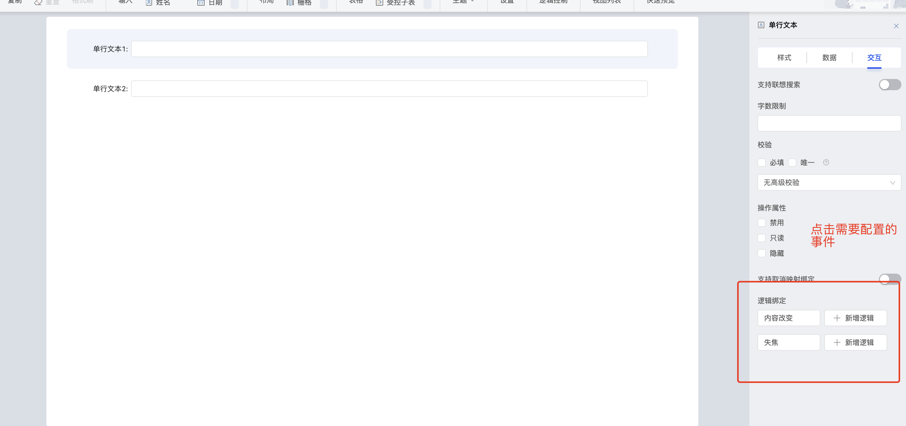
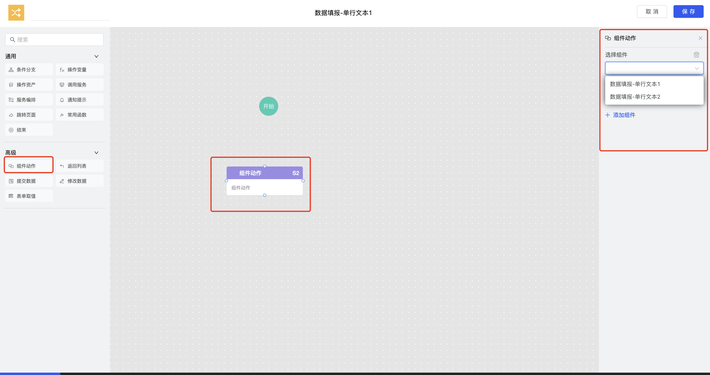
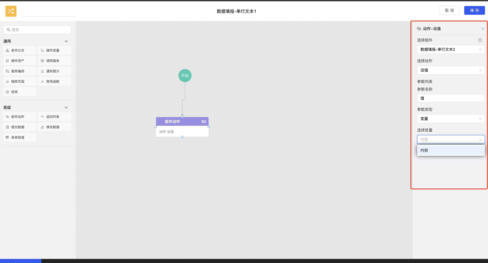
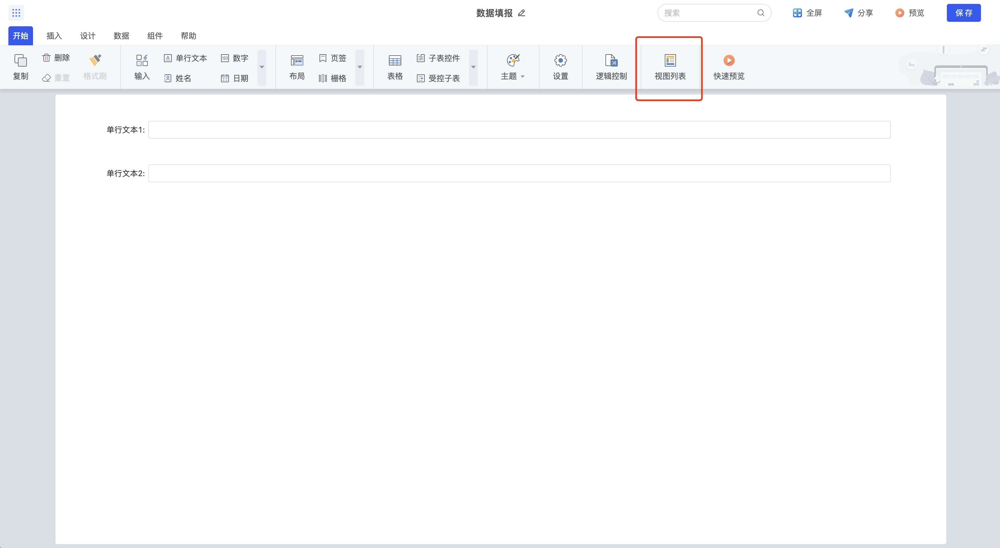
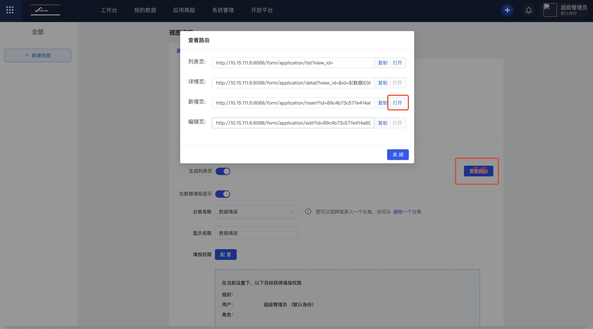
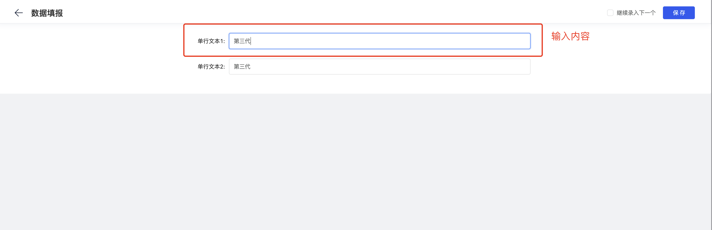

[TOC]

## 原理说明

逻辑控制指的将组件事件与动作开放，通过配置事件触发驱动动作的执行，将配置信息集中存储到事件中心，组件事件触发通知事件中心，事件中心按照配置分发执行组件动作，最终实现完全独立的组件之间建立逻辑通信。例如：下拉框组件的内容改变事件关联Input组件动作的显示隐藏，当下拉框内容改变的时候，通过事件中心，触发Input组件显示隐藏动作。

此处的逻辑控制的对象包括应用、大屏、分析仪、填报。

## 功能说明

逻辑控制的流程的关键组件中心和事件中心。注册中心指的是将所有开放的组件事件与动作集中缓存，输出相关API逻辑控制供配置页面获取相关组件配置信息。事件中心指的是通过逻辑控制配置页面保存下来的配置信息，通过统一的查询接口，暂存到事件中心，所有组件的事件触发全部通知到事件中心，由事件中心统一分发，两者相互配合，实现插件的逻辑控制。

组件中心主要功能如下所示。

## 流程说明

逻辑控制执行流程如下图所示。

1. 声明组件事件与动作，将组件注册到组件中心。
2. 组件中心，提供逻辑控制配置页面的 相关API接口，供组件动作节点使用。
3. 逻辑控制配置完成，节点详情注册到事件中心。
4. 组件触发事件时，通知事件中心，查询此组件此事件对应的逻辑控制。
5. 事件中心将查询到的逻辑控制中配置的各个组件动作，分发执行。

## 接口说明

| 接口 | 接口参数说明 | 描述 |
| --- | --- | --- |
| 在组件中心注册组件。 需要将组件注册到组件中心，以供逻辑控制配置的时候可以获取到页面中渲染的组件。 | 注册接口： window.componentCenter.register(id, type, ref, eventActionConfig) | ●　id：二开插件标识，string类型。 ●　type:固定配置为“comp”。 ●　ref：二开插件组件实例，obj类型。 ●　eventActionConfig：事件/动作的声明文件。    |
| 在组件中心更新组件注册配置。 插件包注册成功后，支持对组件的参数进行修改即更新实例或者更新配置 | ● 注册接口： window.componentCenter.registerInstance(id, ref)  ● 更新配置接口： window.componentCenter.registerConfig(id, eventActionConfig) | ●　id：二开插件标识，string类型。 ●　ref：二开插件组件实例，obj类型。 ●　eventActionConfig：事件/动作的声明文件，obj类型。    |
| 在组件中心删除组件的注册配置。  组件移除时，需要将组件中心收录的组件信息删除。 | 注销接口：window.componentCenter.removeInstance(id) | id：二开插件标识，string类型。    |
| 组件事件触发的时候需要通知事件中心，组件中心获取组件是否注册当前事件的逻辑控制，查询并执行。 | 调用执行接口：window.eventCenter.triggerEventNew(objectId, id, type, event, payload) | ● objectID：模块唯一id。 ● ID：二开插件标识。 ● type：二开插件所属模块，取值类型包括：  ◇ 应用：app  ◇ 填报：report   ◇  大屏：bigscreen   ◇ 业务流：eventflow  ● payload： 事件触发返回数据 例：{value: 123 }，obj类型。 |

## 接入案例

步骤1、组件事件与动作的声明。

~~~
// msgCompConfig.js
// 组件可派发事件
export const events = [
  {
    key: "change",
    name: "内容改变",
    payload: [
      {
        name: "内容",
        key: "value",
        dataType: "string",
      },
    ],
  },
];
// 组件可接收事件
export const actions = [
  {
    key: "setValue",
    name: "设值",
    isSupportChild: true, // 是否支持子表 填饱专用
    params: [
      {
        key: "value",
        name: "值",
        dataType: "string",
      },
    ],
  },
  {
    key: "getValue",
    name: "取值",
    isSupportChild: true, // 是否支持子表 填饱专用
    hasReturn: true,
    returns: [
      {
        key: "value",
        name: "值",
        dataType: "string",
      },
    ],
  },
];
export default {
  actions,
  events,
};
~~~

步骤2、组件注册。

~~~
import eventActionDefine from "./msgCompConfig";

// 组件注册到组件中心
window?.componentCenter?.register(
  this.customConfig.componentId, // 组件唯一ID
  "comp", // 组件类型
  this, // 组件实例
  eventActionDefine // 组件事件与动作的配置
);
~~~

步骤3、动作声明。

~~~
// 获取组件名称 -- 以填报为例
Event_Center_getName() {
  let { formConfig, component } = this.customConfig;
  return `${formConfig?.form_name}-${component.columnStyle.title}`;
},
// 组件获取value
Event_Center_getName() {
  return this.data;
},
// 组件设置value
do_EventCenter_setValue({ value }) {
  this.data = value;
},
~~~

步骤4、事件触发。

~~~
// 二开的 customConfig 中获取相关字段
// formConfig.id 填报id
// component.id 组件id
// child_id index 为填报子表组件采用
let { formConfig, component } = this.customConfig;
let { formConfig, component, child_id, index } = this.customConfig;
let initId = `${component?.id}__childId__${child_id.substr(0, 10)}`;

// 组件支持子表操作
if(child_id){
    initId = `${initId}__childId__${child_id.substr(0, 10)}`
}

await window.eventCenter.triggerEventNew({
    objectId: formConfig?.id,
    componentId: initId,
    type: "report",
    event: "change",
    payload: {
      value: e,
    },
});
~~~

步骤5、组件销毁。

~~~
// 组件注销时，删除组件中心的 组件实例与组件配置
destroyed() {
    window?.componentCenter?.removeInstance(this.customConfig.componentId);
}
~~~

## 效果演示

此处以填报为例。

步骤1. 选择组件。

a. 在填报设计页面，拖入组件，单击“保存”。

b. 选中组件，单击“交互”。

c. 选择需要配置的逻辑事件。

步骤2. 逻辑控制配置。

a. 单击“新增逻辑”。
b. 拖拽组件动作节点，与开始节点连接。
c. 单击选中此节点，新增组件。
d. 选择“组件 > 设值”配置如下图。
e. 单击“保存”。

步骤3. 逻辑控制执行。

a. 在填报设计编辑页选择“开始 > 视图列表”，打开视图列表。
b. 单击“查看路由”。
c. 单击新增页后的“打开”。
d. 在“单行文本1”中输入内容，预期“单行文本2”内容会同步变化。

