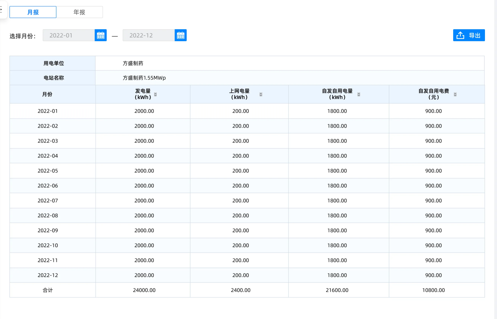

## 组件预览

---
## 用户输入 

### assetId
**`字段描述`**
资产id
**`样例`**
>db5d25a6-b167-4ead-b7eb-ef6510f3b7ee
### speedTime
**`字段描述`**
轮播时间,多少秒切换图片
**`样例`**
5

### imgField
**`字段描述`**
资产表中图片列所对应的列名
**`样例`**
imgUrl

### titleField
**`字段描述`**
资产表中标题列所对应的列名
**`样例`**
titleField

### detailsUrl
**`字段描述`**
跳转详情页所需要的地址
**`样例`**
/app/edit?appid=c8265900-a96d-bd95

### keyField
**`字段描述`**
跳转详情页所需要参数键名
**`样例`**
data_id

---
## 逻辑控制
### events
#### valueChange
**`字段描述`**
值改变事件
**`提供数据`**
+ **数据名称**:改变之后的值
+ **数据类型**:string
+ **数据样例**：基层五队
